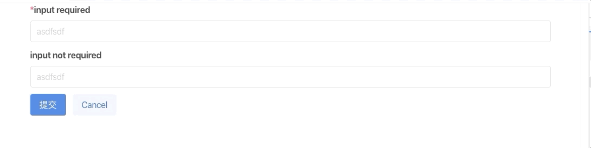

# bulma-react-form

 simple form validate 、auto inject  and show error when need  , display UI with framework `bulma` .

[](https://www.npmjs.com/package/bulma-react-form) [](https://standardjs.com)


## Install

```bash
npm install --save bulma-react-form
```

## Usage
```jsx
import React, {Component} from 'react'

import {formWrapper, FormItem, Input} from 'bulma-react-form'

class App extends Component {
  render() {
    const {form} = this.props;
    return (
      <div className='container'>
        <FormItem label='input required' field={'test'}>
          {form.getFieldDecorator('test', {
            rules: [{
              required: true,
              message: 'This component is required , you can define anything here'
            }]
          })(
            <Input placeholder={'asdfsdf'}/>
          )}
        </FormItem>
        <FormItem label='input not required' field={'test2'}>
          {form.getFieldDecorator('test2')(
            <Input placeholder={'asdfsdf'}/>
          )}
        </FormItem>
        <div className="field is-grouped">
          <div className="control">
            <button className="button is-link" onClick={() => form.validateFields()}>提交</button>
          </div>
          <div className="control">
            <button className="button is-link is-light">Cancel</button>
          </div>
        </div>
      </div>
    )
  }
}

export default formWrapper(App);

```

## License

MIT © [eaTong](https://github.com/eaTong)
